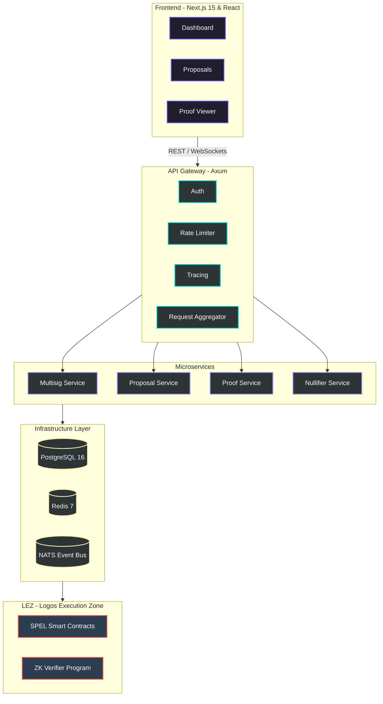

<div align="center">

# 🛡️ ShadowSig

**Privacy-Preserving Multisig Infrastructure for the Logos Execution Zone**

*Anonymous approvals. Shielded governance. Threshold proofs secured by Risc0.*

[](https://github.com/shadowsig/shadowsig/actions)
[](LICENSE)

</div>

---

## Overview

ShadowSig is a production-grade privacy-preserving M-of-N multisig platform where:

- **Members use shielded accounts** — identities are never revealed
- **Approvals are anonymous** — votes are unlinkable to signers
- **Threshold proofs are verified on-chain** — only proof of quorum completion is visible
- **Executions are unlinkable** — treasury actions cannot be traced to approving members

## Architecture



## Tech Stack

| Layer | Technology |
|-------|-----------|
| Frontend | Next.js 15, TypeScript, Tailwind CSS, Framer Motion, Recharts |
| Backend | Rust, Axum, Tokio, SQLx |
| Database | PostgreSQL 16, Redis 7, NATS |
| ZK Proofs | Risc0 zkVM, SHA-256 Merkle trees |
| Blockchain | LEZ, SPEL smart contracts |
| DevOps | Docker, Kubernetes, GitHub Actions, Prometheus, Grafana |

## Quick Start

### Prerequisites

- Node.js 20+
- Rust 1.82+
- Docker & Docker Compose

### Local Development

```bash
# Clone the repository
git clone https://github.com/shadowsig/shadowsig.git
cd shadowsig

# Start infrastructure (Postgres, Redis, NATS)
docker compose -f infrastructure/docker/docker-compose.yml up -d postgres redis nats

# Start the frontend
cd apps/web
bun install
bun run dev

# Start the backend (in another terminal)
cd apps/api
cargo run
```

### Docker (Full Stack)

```bash
docker compose -f infrastructure/docker/docker-compose.yml up
```

The frontend will be available at `http://localhost:3000` and the API at `http://localhost:8080`.

## Project Structure

```
shadowsig/
├── apps/
│   ├── web/                    # Next.js 15 frontend
│   └── api/                    # Rust Axum backend
├── packages/
│   ├── ui/                     # Shared React components
│   ├── types/                  # Shared TypeScript types
│   └── crypto/                 # Client-side crypto utils
├── services/
│   ├── proof-service/          # Risc0 proof generation
│   ├── proposal-service/       # Proposal lifecycle
│   ├── event-service/          # WebSocket + event streaming
│   └── nullifier-service/      # Replay protection
├── contracts/
│   ├── lez-program/            # LEZ verifier program
│   └── verifier/               # On-chain verifier
├── infrastructure/
│   ├── docker/                 # Docker configs
│   ├── k8s/                    # Kubernetes manifests
│   └── terraform/              # IaC templates
└── docs/                       # Documentation
```

## API Endpoints

| Method | Path | Description |
|--------|------|-------------|
| `GET` | `/health` | Health check |
| `POST` | `/api/multisigs` | Create multisig |
| `GET` | `/api/multisigs` | List multisigs |
| `POST` | `/api/proposals` | Create proposal |
| `GET` | `/api/proposals` | List proposals |
| `POST` | `/api/approvals` | Submit anonymous approval |
| `POST` | `/api/proofs/generate` | Generate zk proof |
| `GET` | `/api/proofs/:id` | Get proof status |
| `POST` | `/api/execute` | Execute threshold action |
| `GET` | `/api/metrics` | Prometheus metrics |

## Security Model

- **Shielded Identities**: Members are identified by commitments, never by public keys
- **Nullifier Protection**: Cryptographic nullifiers prevent double-voting
- **Local Proof Generation**: Proofs are generated client-side before submission
- **Secret Zeroization**: Sensitive data is zeroed from memory after use
- **Encrypted Storage**: All local storage is encrypted
- **Audit Logging**: All proof and verification operations are logged

## License

MIT
