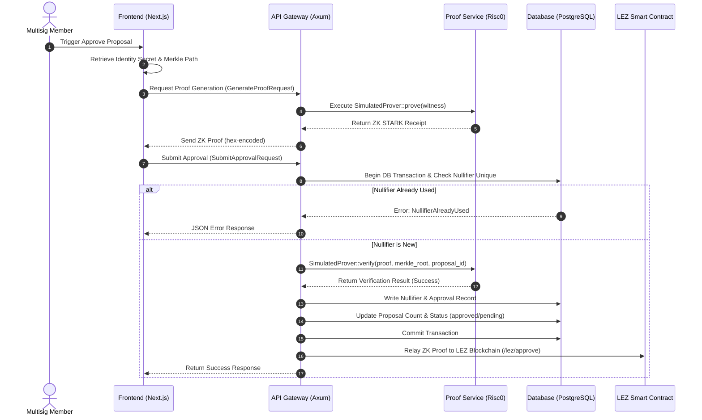

# Architecture

## System Overview

ShadowSig is a privacy-preserving M-of-N multisig platform built for the Logos Execution Zone (LEZ). The system enables anonymous approval of governance proposals using zero-knowledge proofs, ensuring that on-chain state reveals only that a quorum was reached — never which members approved.

## Architecture Diagram

```
┌─────────────────────────────────────────────────────────────┐
│                    Basecamp Frontend                         │
│                   Next.js 15 + React 19                      │
│         ┌───────────┬──────────┬──────────────┐             │
│         │ Dashboard  │ Proposals│ Proof Viewer │             │
│         │ Multisigs  │ Approval │ Treasury     │             │
│         └───────────┴──────────┴──────────────┘             │
└─────────────────────────┬───────────────────────────────────┘
                          │ REST API
┌─────────────────────────┴───────────────────────────────────┐
│                   API Gateway (Axum)                          │
│  ┌────────────────────────────────────────────────────────┐ │
│  │ InMemory Store (fallback) / PostgreSQL (production)    │ │
│  │ ┌──────────┐ ┌──────────┐ ┌──────────┐ ┌───────────┐ │ │
│  │ │ Multisigs│ │Proposals │ │Approvals │ │Nullifiers │ │ │
│  │ └──────────┘ └──────────┘ └──────────┘ └───────────┘ │ │
│  └────────────────────────────────────────────────────────┘ │
└────┬──────────────────────────────────────────────────┬─────┘
     │                                                  │
┌────┴───────────────────┐    ┌────────────────────────┴─────┐
│   Proof Service        │    │   LEZ Verifier Program       │
│   (Risc0 Host)         │    │   (SPEL Smart Contract)      │
│   ┌──────────────────┐ │    │   ┌──────────────────────┐  │
│   │ SimulatedProver  │ │    │   │ MultisigConfig       │  │
│   │ (dev fallback)   │ │    │   │ Proposal             │  │
│   └──────────────────┘ │    │   │ NullifierRegistry    │  │
│   ┌──────────────────┐ │    │   └──────────────────────┘  │
│   │ Risc0Prover      │ │    │                              │
│   │ (STARK receipts) │ │    │   SPEL IDL: idl.json        │
│   └──────────────────┘ │    └──────────────────────────────┘
└────┬───────────────────┘
     │
┌────┴───────────────────┐
│   Risc0 Guest (zkVM)   │
│   ┌──────────────────┐ │
│   │ Merkle membership│ │
│   │ Nullifier derive │ │
│   │ Proposal binding │ │
│   └──────────────────┘ │
└────────────────────────┘
```

## Component Responsibilities

### Frontend (apps/web)
- **Dashboard**: Overview of multisigs, proposals, proofs, activity
- **Multisig Management**: Create vaults with M-of-N configuration, generate member identities
- **Proposal Management**: Create governance proposals, track approval progress
- **Proof Generation UX**: Animated 6-step ZK proof builder with live status
- **Treasury**: View execution history and treasury balances

### API Gateway (apps/api)
- **Axum** HTTP server with CORS, tracing, compression
- **InMemory Store** for zero-config development (automatic fallback)
- **PostgreSQL** support for production deployments
- **Routes**: CRUD for multisigs, proposals, approvals, execution, metrics

### Proof Service (risc0/)
- **Guest Program**: Runs inside RISC0 zkVM, proves membership + nullifier
- **Host Prover**: Drives guest execution, produces STARK receipts
- **SimulatedProver**: Host-side fallback when risc0 toolchain is unavailable

### LEZ Verifier (programs/shadowsig-verifier)
- **MultisigConfig**: Stores Merkle root, threshold, member count
- **Proposal**: Tracks approval count and execution status
- **NullifierRegistry**: Prevents double-voting via consumed nullifier set
- **SPEL IDL**: Defines on-chain interface for client code generation

### TypeScript SDK (packages/sdk)
- **Identity generation**: CSPRNG secrets + SHA-256 commitments
- **Merkle tree construction**: Build tree, generate proofs, verify membership
- **API client**: Typed wrappers for all gateway endpoints
- **Local proof generation**: Client-side proof preparation

## Data Flow

1. **Setup**: Members generate identity secrets → commitments → Merkle tree → on-chain config
2. **Propose**: Any member creates a proposal with action details
3. **Approve**: Members locally generate ZK proofs (membership + nullifier) and submit anonymously
4. **Verify**: Contract checks proof, nullifier uniqueness, increments approval count
5. **Execute**: Any relayer triggers execution once threshold is met — unlinkable to approvers

## ZK Proof Submission & Validation Flow


